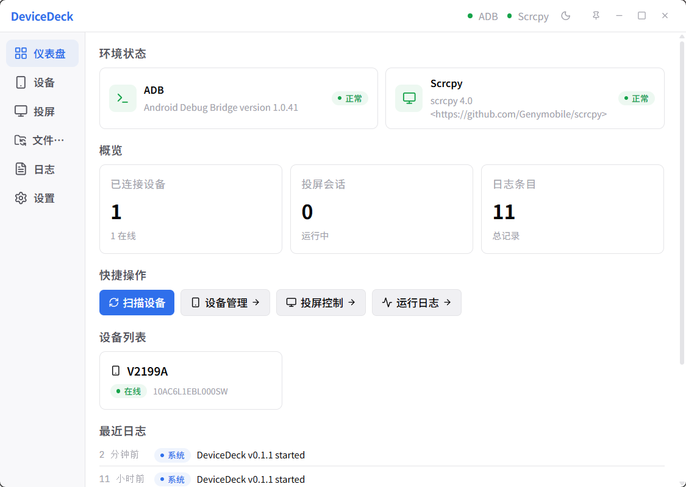
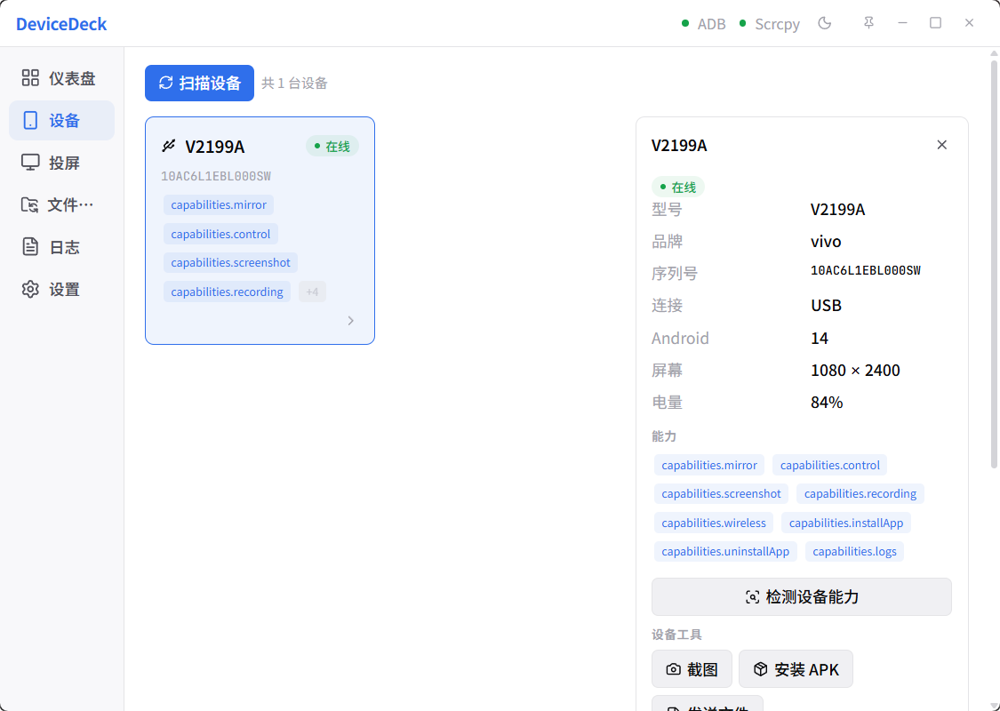
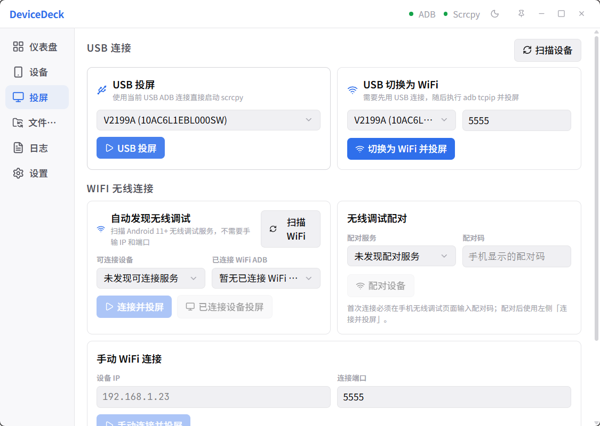
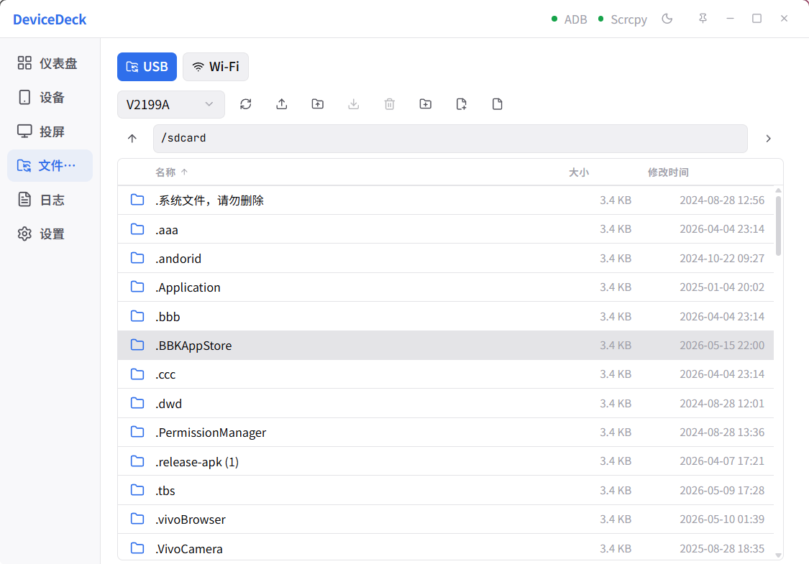
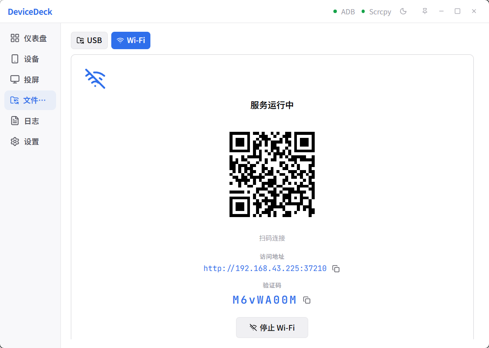
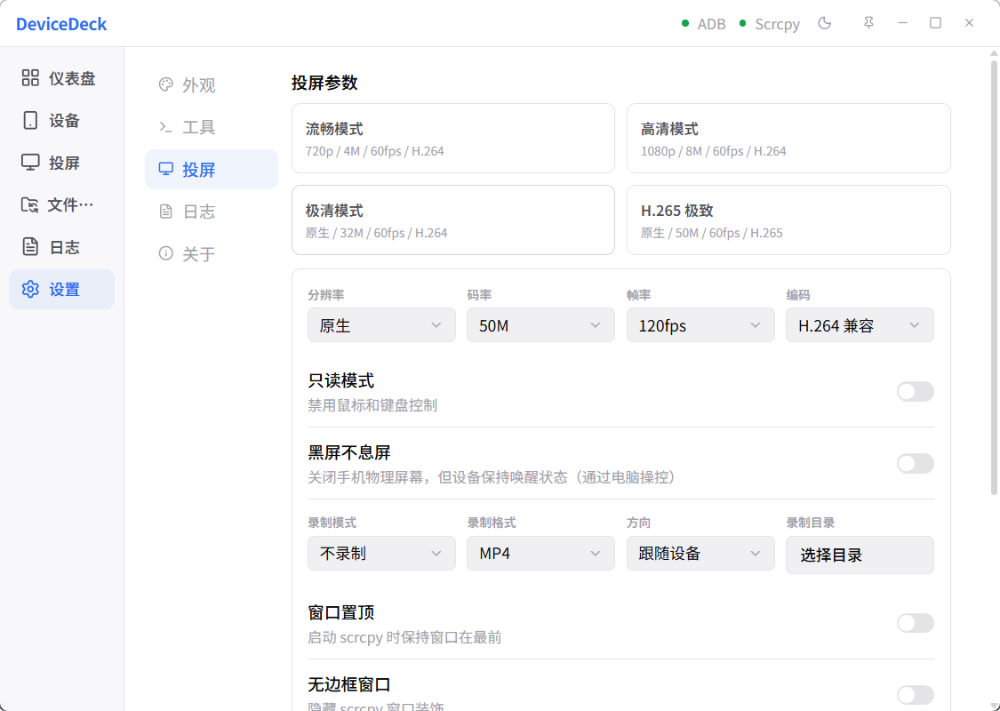

<div align="center">

# DeviceDeck

**🌐 语言**: [English](./README.md) | [中文](#)


基于 Tauri 2 和 Rust 构建的现代化 Android 屏幕镜像与设备管理工作站。轻量、高效、原生体验。

**[功能特性](#-功能特性)** • **[界面截图](#-界面截图)** • **[快速开始](#-快速开始)** • **[技术栈](#-技术栈)** • **[下载](#-下载)**



</div>

## 功能特性

- **多协议连接** — 支持 USB、WiFi 直连、自动设备发现及 Android 11+ 无线配对，一键即可连接设备
- **高清屏幕镜像** — 基于 Scrcpy 的实时镜像，支持 480p 到 1080p+ 分辨率，15/30/60 帧率可选，延迟低至 12ms
- **实时状态监控** — 设备在线 / 离线 / 未授权状态一目了然，支持同时管理多台设备的全生命周期
- **自定义编码** — H.264 / H.265 / AV1 编码自由切换，码率 1-16 Mbps 精细调节。提供性能、均衡、画质、极致四档预设
- **多源日志系统** — 汇聚 System / ADB / Scrcpy 三路日志，支持关键词过滤与自动清理，调试再也不丢信息
- **文件传输** — USB 有线传输配备完整文件浏览器，WiFi 无线传输支持手机扫码即传，无需安装客户端
- **环境检测** — 自动检测 ADB 和 Scrcpy 工具链可用性，首次使用也能快速定位环境问题

## 界面截图

<div align="center">
<table>
  <tr>
    <td align="center"><br /><b>控制台</b></td>
    <td align="center"><br /><b>设备详情</b></td>
  </tr>
  <tr>
    <td align="center"><br /><b>屏幕镜像</b></td>
    <td align="center"><br /><b>USB 传输</b></td>
  </tr>
  <tr>
    <td align="center"><br /><b>WiFi 传输</b></td>
    <td align="center"><br /><b>镜像设置</b></td>
  </tr>
</table>
</div>

## 技术栈

| 层级 | 技术 |
|------|------|
| 前端 | React 19, TypeScript 5.8, Zustand 5, TailwindCSS 4, Vite 7, i18next |
| 后端 | Tauri 2, Rust, Axum 0.8, tokio, rusqlite 0.31 |
| 数据库 | SQLite（日志持久化） |
| 外部工具 | ADB, Scrcpy（内置或自定义路径） |
| 测试 | Vitest, cargo test |
| 包管理器 | pnpm |

## 快速开始

```bash
# 安装依赖
pnpm install

# 开发模式（前端 + Rust 后端）
pnpm tauri dev

# 仅前端（Vite，端口 1420）
pnpm dev
```

## 构建

```bash
# 生产构建（Windows: .msi + .exe，Linux: .deb + .AppImage，macOS: .dmg + .app）
pnpm tauri build

# 类型检查
pnpm build && cargo check --manifest-path src-tauri/Cargo.toml
```

## 下载

从 [GitHub Releases](https://github.com/shenjianZ/DeviceDeck/releases) 下载适合您平台的安装包。

## 许可证

[MIT](./LICENSE)
